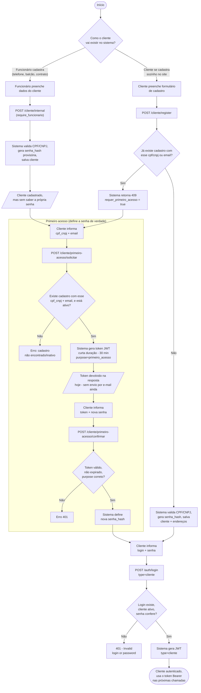

# Processo: Cadastro e autenticação do cliente

Cobre os três jeitos de um cliente "existir" no sistema (cadastro interno pelo funcionário, cadastro self-service pelo próprio cliente, e o fluxo de primeiro acesso que liga os dois) mais o login. Endpoints reais envolvidos: `POST /cliente/internal`, `POST /cliente/register`, `POST /cliente/primeiro-acesso/solicitar`, `POST /cliente/primeiro-acesso/confirmar`, `POST /auth/login`.

## Diagrama de atividades

## Walkthrough passo a passo

**1. Cadastro pelo funcionário (`POST /cliente/internal`)**
Usado quando o atendimento é por telefone/balcão, ou quando o cliente vai virar contato de uma empresa parceira. O funcionário informa os dados do cliente (inclusive uma senha), o sistema já valida CPF/CNPJ e salva com `senha_hash` — mas essa senha é só provisória: o cliente ainda não sabe qual é, então precisa passar pelo primeiro acesso antes de conseguir logar sozinho.

**2. Cadastro self-service (`POST /cliente/register`)**
O próprio cliente se cadastra pelo site. Antes de criar, o sistema checa se já existe alguém com aquele `cpf_cnpj` **ou** aquele `email` (`ClienteRepository.get_by_documento_or_email`). Se já existir — por exemplo, porque um funcionário cadastrou esse cliente antes — a API responde `409 Conflict` com `{"requer_primeiro_acesso": true}`, sinalizando pro frontend que o caminho certo agora é o primeiro acesso, não tentar de novo com outro registro. Se não existir, cria a conta com senha já hasheada (bcrypt) e o cliente pode logar direto, sem passar por primeiro acesso.

**3. Primeiro acesso**
Fluxo de duas etapas, pensado pra ligar um cadastro que já existe (feito por funcionário, ou detectado como duplicado no passo 2) a uma senha que só o cliente conhece:
- `POST /cliente/primeiro-acesso/solicitar` com `cpf_cnpj` + `email` — o sistema confirma que existe um cadastro ativo com essa combinação e gera um token JWT de curta duração (30 minutos, com `purpose=primeiro_acesso` embutido, pra não poder ser reaproveitado como token de login normal).
- `POST /cliente/primeiro-acesso/confirmar` com esse `token` + a `senha` nova — o sistema decodifica o token, confere validade/expiração/propósito, e substitui o `senha_hash` do cliente.

Simplificação assumida hoje: o token volta na própria resposta da API, em vez de ser enviado por e-mail/SMS. Isso é um placeholder até existir infraestrutura de envio — em produção, o passo de "solicitar" devolveria só uma confirmação genérica ("se o cadastro existir, enviamos as instruções"), e o token chegaria por e-mail.

**4. Login (`POST /auth/login`)**
Vale tanto pra cliente quanto pra funcionário, diferenciado pelo campo `type`. Pra cliente: busca por `login`, confere se está `ativo`, confere a senha com `verify_password` contra o `senha_hash`. Se tudo bater, gera um JWT com `{login, type: "cliente"}` — esse token vai no header `Authorization: Bearer` de todas as chamadas seguintes que exigem autenticação.

## Observações / limitações conhecidas

- O token de primeiro acesso hoje é devolvido na resposta da API — não tem envio de e-mail real implementado ainda.
- Não existe endpoint de "editar meu próprio perfil" pro cliente (RF002 da fase 2 do checklist) nem de troca de senha fora do fluxo de primeiro acesso — hoje a única forma de trocar senha é repetir o fluxo de primeiro acesso.
- `ClienteService.soft_delete` self-service existe no service, mas não tem rota exposta pro cliente se autoexcluir — só o funcionário tem essa rota (`DELETE /cliente/internal/{id}`).
