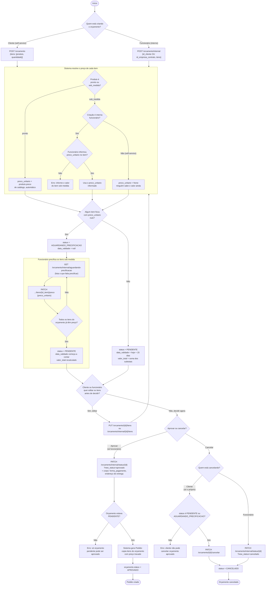

# Processo: Orçamento — da criação até virar pedido (ou ser cancelado)

É o processo com mais regra de negócio do sistema: um orçamento pode nascer do próprio cliente (self-service) ou de um funcionário (atendimento interno / empresa contratante), pode precisar esperar um vendedor precificar item sob medida, pode ser editado, e no fim vira `Pedido` (aprovado) ou é descartado (cancelado). Endpoints envolvidos: `POST /orcamento`, `POST /orcamento/internal`, `GET /orcamento/internal/aguardando-precificacao`, `GET /orcamento/{id}` (e sua versão `/internal`), `PUT .../itens`, `PATCH .../itens/{id_item}/preco`, `PATCH /orcamento/internal/status/{id}` e `PATCH /orcamento/{id}/cancelar`.

## Diagrama de atividades

## Walkthrough passo a passo

**1. Criação**
Duas portas de entrada pro mesmo fluxo. Self-service (`POST /orcamento`): o cliente só manda produto + quantidade, sempre associado ao próprio `id_cliente` extraído do token. Interno (`POST /orcamento/internal`, funcionário): informa `id_cliente` **ou** `id_empresa_contrato`, e pode (opcionalmente) já informar `preco_unitario` por item — é o único caminho onde isso é aceito.

**2. Resolução de preço por item**
Pra cada item, o sistema olha `produto.tipo_producao`:
- **Pronto**: usa sempre `produto.preco` de catálogo, ninguém escolhe o valor.
- **Sob medida**: não tem preço de tabela.
  - Se veio de uma criação **interna**, o funcionário precisa ter informado `preco_unitario` no item — senão a chamada falha (`ValueError`) antes mesmo de salvar.
  - Se veio do **self-service**, o sistema deliberadamente deixa `preco_unitario = None`: o cliente não tem como saber esse valor na hora, só um vendedor consegue precificar.

**3. Status derivado da precificação**
Depois de resolver todos os itens: se **algum** ficou sem preço, o orçamento entra em `AGUARDANDO_PRECIFICACAO` (sem `data_validade` ainda — não faz sentido contar prazo de validade de algo que nem tem preço fechado). Se **todos** já têm preço, vai direto pra `PENDENTE`, com `data_validade = hoje + 15 dias`.

**4. Precificação pendente**
Só entra em jogo quando o orçamento ficou em `AGUARDANDO_PRECIFICACAO`. O funcionário lista o que está esperando (`GET /orcamento/internal/aguardando-precificacao`) e define o valor item a item (`PATCH .../itens/{id_item_orcamento}/preco`). Quando o **último** item pendente recebe preço, o sistema muda o status pra `PENDENTE` e só *nesse momento* começa a contar os 15 dias de validade — não desde a criação.

**5. Edição de itens**
Permitida enquanto o orçamento estiver `PENDENTE` ou `AGUARDANDO_PRECIFICACAO` (depois de `APROVADO` ou `CANCELADO`, não). Reaplica exatamente a mesma lógica dos passos 2 e 3 — inclusive pode fazer um orçamento que já estava `PENDENTE` voltar a `AGUARDANDO_PRECIFICACAO`, se um item sob medida novo for adicionado sem preço.

**6. Aprovação**
Só funcionário aprova (`PATCH /orcamento/internal/status/{id}?new_status=aprovado`), e só a partir de `PENDENTE`. Diferente dos outros campos, `forma_pagamento` e o endereço de entrega **não fazem parte do orçamento** — são informados só nesse momento, no corpo da requisição (`forma_pagamento` + `id_endereco_entrega` ou `endereco_entrega_texto`), porque é o momento em que o orçamento "vira venda" de fato. O sistema copia os itens do orçamento pro novo `Pedido`, com preço travado (não recalcula a partir do catálogo de novo).

**7. Cancelamento**
Duas regras diferentes dependendo de quem cancela:
- **Cliente**: só pode cancelar o **próprio** orçamento, e só se ele ainda estiver `PENDENTE` ou `AGUARDANDO_PRECIFICACAO`.
- **Funcionário**: pode cancelar de `PENDENTE`, `APROVADO` ou `AGUARDANDO_PRECIFICACAO`.

## Observações / limitações conhecidas

- Não existe rotina automática que expira orçamento vencido (`data_validade` no passado deveria virar `EXPIRADO` sozinho) — hoje esse status existe no enum, mas só é usado se alguém chamar a transição manualmente.
- Quando um funcionário cancela um orçamento que já estava `APROVADO` (e por isso já gerou um `Pedido`), o `Pedido` **não é tocado** — ele continua existindo normalmente, sem vínculo com o cancelamento. Se isso importar pro fluxo real da loja, precisa decidir separadamente se cancelar o pedido nesse caso é automático ou uma ação manual à parte.
- `PATCH /orcamento/internal/status/{id}` aceita qualquer transição de status prevista nas regras (aprovar/cancelar/expirar) pela mesma rota — o "aprovar" e o "cancelar pelo funcionário" não são endpoints separados, o que muda é o `new_status` na query string.
