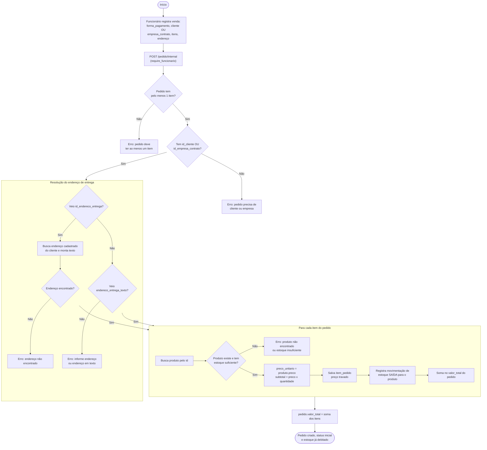

# Processo: Criação de pedido interno (sem passar por orçamento)

Venda direta registrada por um funcionário — atendimento de balcão/telefone, ou venda pra uma empresa contratante — sem precisar de um orçamento antes. Endpoint envolvido: `POST /pedido/internal`.

## Diagrama de atividades

## Walkthrough passo a passo

**1. Registro pelo funcionário**
Só existe o caminho interno hoje (`POST /pedido/internal`, exige token de funcionário). O funcionário informa forma de pagamento, o vínculo do pedido (`id_cliente` **ou** `id_empresa_contrato` — nunca os dois vazios), a lista de itens (produto + quantidade) e o endereço de entrega.

**2. Validações antes de tocar no banco**
O pedido precisa ter pelo menos 1 item, e precisa estar vinculado a um cliente ou a uma empresa contratante — sem isso, a criação nem chega a abrir a transação.

**3. Resolução do endereço**
Mesma lógica usada quando um orçamento é aprovado (ver processo de Orçamento): se vier um `id_endereco_entrega`, o sistema busca o endereço cadastrado do cliente e monta um texto formatado (`logradouro, número, bairro, cidade - estado, CEP`); se não vier, usa direto o `endereco_entrega_texto` enviado. Uma venda pra empresa contratante normalmente cai nesse segundo caso, porque empresa não tem `endereco_cliente` cadastrado.

**4. Criação dos itens, um por um**
Para cada item: busca o produto, confere se existe e se tem `quantidade_estoque` suficiente pra atender a quantidade pedida. Se passar, trava o `preco_unitario` no valor de catálogo do produto no momento da venda (preço não muda depois, mesmo que o produto mude de preço no catálogo no futuro) e calcula o `subtotal`. Em seguida registra uma movimentação de estoque de **saída** — é esse registro que efetivamente reduz o `quantidade_estoque` do produto, não uma atualização direta.

**5. Fechamento**
O `valor_total` do pedido é a soma dos subtotais de todos os itens processados no passo 4.

## Observações / limitações conhecidas

- Não existe rota self-service pra cliente fechar o próprio pedido direto (sem passar por orçamento) — hoje a única forma de um cliente self-service gerar um `Pedido` é pelo fluxo de orçamento aprovado (ver `processo-orcamento-ate-pedido.md`). O `PedidoService.save()` já tem um parâmetro `internal=False` pensado pra isso, mas não tem rota exposta ainda, e depende de trocar a checagem de permissão de cliente (hoje ainda usa `check_user_permission`, que rejeita token de cliente) pelo mesmo `get_current_cliente` já usado em outros fluxos.
- `PedidoService.update_status` (mudar status pendente → pago → em_separação → ... → entregue/cancelado) existe no service, mas não tem rota exposta em `pedido_routes.py` ainda.
- Cancelar um pedido deveria devolver a quantidade ao estoque (movimentação de entrada) — essa regra está descrita em `documentacao/requisitos_por_entidade.md` (`RN-PED-03`), mas ainda não está implementada no `update_status`.
